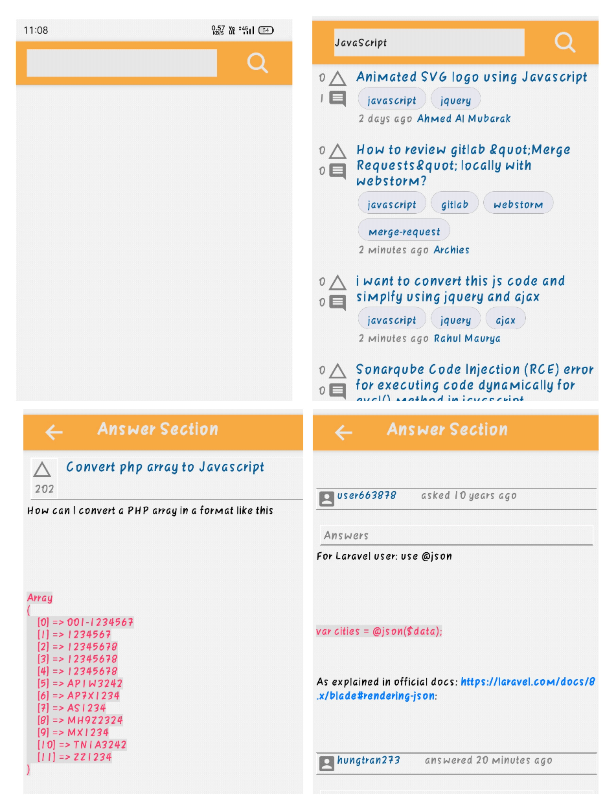

# RN_Task

 A simple react native app for searching and reading StackOverflow questions 

# Features

1. The app has provided with a search bar. On querying for a term, it searches through all the 
StackOverflow questions with that query and shows the top 20 results in the Home Screen. 
2. Every result shows the total votes on that question, the brief text of the question and the 
person asking the question. 

# API

You can get access to the stack app https://api.stackexchange.com/docs here.

# Download App

You can download the app using the below link 
https://bit.ly/3zNzHSu

# Screenshots

# Development

This project doesn't require basic react native setup to get up and running. 
Install the expo-sdk and get started. Read more about expo at https://expo.io 
Run the below commands in sequence to start the development server in expo. 
In order to start the development server without expo, read the React Native docs at https://reactnative.dev 

1. git clone https://github.com/Vinaypd7/RN_Task.git 
2. cd RN_Task 
3. npm i expo 
4. expo install or npm install 
5. expo start

